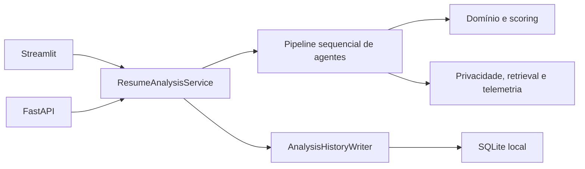
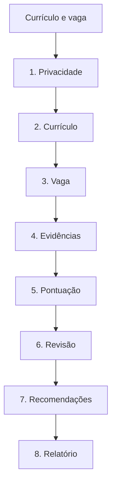

# Resume Match AI

### Análise local, explicável e multiagente de currículos e vagas

[](pyproject.toml)
[](pyproject.toml)
[](https://github.com/viniciusrodriguesai/resume-agent-system/actions/workflows/ci.yml)
[](LICENSE)

Resume Match AI compara um currículo com uma descrição de vaga, encontra evidências
por requisito e gera score, diagnóstico e recomendações rastreáveis. O processamento
é local, funciona sem serviço pago e mantém um caminho lexical quando modelos
opcionais não estão disponíveis.

> O resultado apoia revisão humana. Não deve decidir contratação, inferir atributos
> sensíveis nem produzir ranking definitivo de pessoas.

## Problema

Descrições de vaga misturam requisitos obrigatórios, diferenciais e
responsabilidades. Currículos usam vocabulário diferente e podem mencionar uma
tecnologia sem demonstrar experiência. Uma porcentagem sem evidência não explica
essas diferenças e pode incentivar decisões frágeis.

## Proposta

O sistema:

- anonimiza identificadores antes de embeddings;
- separa a análise em oito agentes com contratos tipados;
- estrutura requisitos e respectivas prioridades;
- combina TF-IDF, RapidFuzz, catálogo de conceitos e, opcionalmente, embeddings e
  reranker;
- mostra o trecho que sustenta cada correspondência;
- aplica score explicável com penalidade para lacunas obrigatórias;
- registra duração, confiança, warnings e metadados por agente;
- oferece interface Streamlit, API FastAPI e relatórios Markdown, JSON e CSV;
- mede qualidade e desempenho com datasets sintéticos reproduzíveis;
- mantém cache e histórico local sob configuração explícita.

## Arquitetura



`app.py` e `api/main.py` são adaptadores. A implementação canônica está em
`resume_ai`; o caso de uso não importa Streamlit nem FastAPI. Persistência depende
da porta `AnalysisHistoryWriter`, cuja implementação padrão é
`SQLiteHistoryRepository`.

O runtime da V6 não usa LangGraph. A orquestração é uma sequência explícita em
`ResumeAnalysisService`, e o revisor produz alertas sem reexecutar o retrieval.

Detalhes: [arquitetura](docs/architecture.md).

## Pipeline multiagente



1. **Privacidade** — remove identificadores diretos do currículo.
2. **Currículo** — extrai competências, formação, experiência, projetos e trechos.
3. **Vaga** — extrai título, requisitos obrigatórios, desejáveis e neutros.
4. **Evidências** — recupera e reranqueia trechos para cada requisito.
5. **Pontuação** — calcula status, categorias e score geral.
6. **Revisão** — sinaliza lacunas obrigatórias e casos próximos dos limiares.
7. **Recomendações** — sugere ações sem inventar experiência.
8. **Relatório** — prepara saída explicável e exportável.

Cada estágio retorna um `AgentResult` com `status`, `duration_ms`, `confidence`,
`warnings`, referências de evidência e metadados operacionais. Falhas preservam a
causa privada para diagnóstico interno sem expor texto arbitrário em logs ou erros
públicos.

## Como o matching funciona

O currículo anonimizado é dividido em trechos limitados. O motor processa os
requisitos em lote e calcula, para cada trecho:

- similaridade lexical TF-IDF;
- similaridade aproximada RapidFuzz;
- cobertura dos conceitos e aliases do catálogo local;
- similaridade semântica, quando o embedding carrega;
- score de CrossEncoder, quando o reranker está ativo.

Com embedding disponível, o score de retrieval combina 42% semântico, 28% lexical,
15% aproximado e 15% cobertura. No fallback, usa 48% lexical, 30% aproximado e 22%
cobertura. Frase exata e cobertura completa recebem boosts controlados; menções
negadas e requisitos cumulativos incompletos são limitados.

O reranker atua apenas nos primeiros candidatos configurados. Se modelo, backend ou
inferência falhar, a análise continua pelo caminho lexical e registra o fallback em
`engine_status` e nos warnings do agente.

O domínio classifica cada requisito como `matched`, `partial` ou `missing`.
Obrigatórios, desejáveis e neutros têm pesos distintos; lacunas obrigatórias limitam
o score para evitar uma nota geral enganosa. Os limiares variam com o rigor
`flexível`, `equilibrado` ou `conservador`.

## Privacidade e segurança

Antes dos embeddings, o agente de privacidade remove e-mail, telefone, CPF, CNPJ,
CEP, RG, URLs, endereços, nascimento, identificadores sociais e uma provável linha
de nome. Presidio pode complementar as expressões regulares no perfil completo.
Anonimização automática é imperfeita e exige revisão humana.

Uploads PDF, DOCX e TXT passam por validação de nome, tamanho, extensão, MIME e
estrutura. O pipeline rejeita PDF truncado, DOCX criptografado, path traversal, links
simbólicos, excesso de entradas, ZIP bombs, XML com entidades e TXT inválido. Erros
de parser são convertidos em mensagens públicas sem caminho local ou detalhe de
biblioteca.

Controles adicionais:

- cache em memória por padrão;
- cache em disco recusado sem consentimento para texto anonimizado;
- histórico SQLite sem currículo, vaga completa ou evidências;
- API key obrigatória para análise quando o ambiente é `production`;
- limite de corpo e rate limiting por processo;
- CORS explícito e security headers;
- logs JSON com allowlist, limites e redação de PII;
- IDs de correlação validados;
- imagem Docker non-root e base fixada por digest;
- segredos, bancos, caches e artefatos privados excluídos do Git e do build.

Leia [segurança](SECURITY.md) e [autenticação](AUTHENTICATION.md) antes de expor a
aplicação em rede.

## Perfis de execução

| Perfil | Retrieval configurado | Reranker | Parsing e PII | Uso |
|---|---|---|---|---|
| `demo` | MiniLM multilingual, Torch | não | parsers base e regex | notebook e CPU |
| `balanced` | multilingual-e5-small, Torch | top 3 | parsers base e regex | equilíbrio local |
| `complete` | BGE-M3, Torch | BGE top 5 | Docling e Presidio | máquina com mais recursos |

Os modelos carregam de forma preguiçosa e são opcionais. O nome do perfil não prova
que o backend carregou; confira a interface, o `engine_status` da API ou o relatório
de benchmark. Para modo estritamente lexical:

```dotenv
RESUME_EMBEDDING_ENABLED=false
RESUME_RERANKER_ENABLED=false
```

Configuração completa: [docs/CONFIGURATION.md](docs/CONFIGURATION.md).

## Instalação

Clone o repositório e permaneça na branch desejada:

```bash
git clone https://github.com/viniciusrodriguesai/resume-agent-system.git
cd resume-agent-system
python -m venv .venv
```

Instalação base:

```bash
python -m pip install --upgrade pip
python -m pip install -r requirements.txt
```

Dependências opcionais:

```bash
python -m pip install -r requirements-ai.txt
python -m pip install -r requirements-full.txt
```

- `requirements.txt`: UI, API, matching lexical, parsers e runtime base;
- `requirements-ai.txt`: Sentence Transformers e Transformers corrigidos para embeddings e reranker;
- `requirements-full.txt`: Presidio, Docling, LanceDB, Prometheus e restrição segura de `cryptography`;
- `requirements-dev.txt`: testes, qualidade, auditoria e build.

Consulte [deployment](docs/DEPLOYMENT.md) para comandos específicos de PowerShell,
Bash, modelos e operação.

## Interface Streamlit

```bash
python -m streamlit run app.py
```

A interface oferece:

- texto colado ou upload validado de PDF, DOCX e TXT;
- perfis demo, balanced e complete;
- rigor flexível, equilibrado e conservador;
- score geral, categorias e resumo;
- evidência e candidatos por requisito;
- recomendações e diagnóstico do revisor;
- relatório de privacidade;
- duração, confiança e warnings dos agentes;
- status real de embedding e reranker;
- download Markdown, JSON e CSV.

A apresentação chama os serviços da aplicação; matching e persistência não são
implementados em `app.py`.

## API FastAPI

```bash
python -m uvicorn api.main:app --host 127.0.0.1 --port 8000
```

| Método | Endpoint | Função |
|---|---|---|
| GET | `/health` | liveness e estado básico |
| GET | `/ready` | readiness do serviço |
| GET | `/v1/profiles` | perfis permitidos |
| POST | `/v1/analyze` | análise tipada |
| GET | `/metrics` | métricas Prometheus ou RSS |

A API limita corpo, texto, perfis e requisições. Erros usam envelope com `code`,
`message` seguro e `request_id`. A resposta devolve `X-Request-ID`; a análise
recebe `Cache-Control: no-store`.

Swagger local: `http://127.0.0.1:8000/docs`.

Contrato e exemplos: [docs/API.md](docs/API.md).

## Docker

Validar a configuração:

```bash
docker compose config
```

Construir e executar:

```bash
docker compose build
docker compose up
```

O Compose publica Streamlit em `127.0.0.1:8501` e FastAPI em
`127.0.0.1:8000`, monta `./data`, executa sem embeddings para startup previsível
e possui healthchecks. A imagem roda como UID 10001 e instala apenas dependências
base.

Uma configuração Compose válida não comprova um build real. O status do daemon,
build e execução é registrado na validação final, não inferido do Dockerfile.

## Avaliação e benchmarks

Os datasets versionados são sintéticos e validados por schemas estritos. O framework
mede:

- Precision, Recall e F1;
- Precision@K e Recall@K;
- MRR e NDCG@K;
- latência média e p95;
- delta estimado de memória RSS;
- duração média de cada agente no pipeline completo.

Benchmark de retrieval sem modelos:

```bash
python scripts/benchmark_retrieval.py --runs 3 --k 3
```

Pipeline completo sem cache, histórico ou modelos:

```bash
python scripts/benchmark_pipeline.py --profile demo --runs 3
```

Para tentar embedding e reranker, acrescente `--include-models` e confirme o backend
real no JSON. Os relatórios registram SHA-256 do dataset, ambiente, parâmetros,
métricas, desempenho e status dos backends.

Este README não publica benchmark ou cobertura sem medição. Metodologia e limites:
[docs/EVALUATION.md](docs/EVALUATION.md).

## Observabilidade

Cada requisição recebe correlação por `X-Request-ID` ou UUID local. Logs estruturados
registram eventos, perfil, estágio, duração, score, cache hit ou miss, contagens e
tipo de erro. Uma allowlist remove campos desconhecidos e redige e-mail, telefone,
strings longas e objetos arbitrários.

Com `prometheus-client`, `/metrics` expõe contadores de análise e cache, histograma
de duração e último score por perfil. Sem o extra, expõe apenas memória RSS.

Métricas são por processo, e o endpoint é público na aplicação. Proteja-o no
deployment. Detalhes: [docs/OBSERVABILITY.md](docs/OBSERVABILITY.md).

## Testes e qualidade

Suíte completa:

```bash
python -m pytest
```

Cobertura:

```bash
python -m pytest --cov=resume_ai --cov-report=term-missing
```

Gates:

```bash
python -m ruff check .
python -m mypy .
python -m pip_audit -r requirements.txt
python -m build
```

As suítes estão organizadas em:

- `tests/unit`;
- `tests/integration`;
- `tests/security`;
- `tests/evaluation`;
- smoke e regressões na raiz de `tests`.

Contagens e cobertura mudam conforme o código. Consulte a validação do commit em vez
de repetir baselines antigos como resultado atual.

## Integração contínua

`.github/workflows/ci.yml` executa:

- unitários em Python 3.11, 3.12 e 3.13;
- integração, segurança e avaliação em Python 3.11;
- Ruff e mypy;
- regressão de qualidade;
- `pip-audit` das dependências base;
- build de sdist e wheel.

Actions de terceiros são fixadas por commit, jobs têm timeout e execuções
substituídas são canceladas. Status local e remoto são evidências distintas; confirme
o commit específico no GitHub Actions.

## Estrutura

```text
resume-agent-system/
├── api/                  FastAPI e erros públicos
├── assets/               CSS do Streamlit
├── data/                 catálogos de exemplo e SQLite local ignorado
├── docs/                 documentação canônica
├── evaluation/           schemas, métricas, datasets e benchmarks
├── examples/             entradas exclusivamente sintéticas
├── resume_ai/
│   ├── agents/           oito agentes e executor comum
│   ├── application/      caso de uso e portas
│   ├── domain/           modelos e scoring
│   ├── infrastructure/   segurança, retrieval, cache, SQLite e telemetria
│   └── presentation/     componentes de apresentação
├── scripts/              avaliação, modelos e operação
├── tests/                unit, integration, security e evaluation
├── app.py                adaptador Streamlit
├── compose.yaml
├── Dockerfile
└── pyproject.toml
```

O pacote distribuído inclui `api`, `evaluation`, `resume_ai` e `app`. Árvores
históricas presentes em cópias locais não fazem parte da implementação canônica.

## Histórico local

`ResumeAnalysisService` depende da porta `AnalysisHistoryWriter`.
`SQLiteHistoryRepository` é o padrão e pode ser desabilitado com
`RESUME_HISTORY_ENABLED=false`. O histórico guarda somente resumo operacional da
análise; currículo, texto integral da vaga e evidências não são salvos.

O arquivo fica em `data/history.sqlite3` e é ignorado pelo Git. O operador controla
permissões, retenção, backup e exclusão. Veja os detalhes atuais de campos e
privacidade em [arquitetura](docs/architecture.md) e [segurança](SECURITY.md).

## Limitações conhecidas

- regex e Presidio não garantem anonimização completa;
- PDF de imagem sem OCR pode não produzir texto útil;
- currículos complexos ou em duas colunas podem ter ordem de extração inadequada;
- parsers executam no processo e não constituem sandbox antimalware;
- o catálogo de conceitos não cobre todos os domínios;
- matching lexical favorece vocabulário semelhante;
- modelos de embedding e labels humanos podem reproduzir vieses;
- os datasets atuais são pequenos e sintéticos;
- não há calibração automática de limiares;
- não há avaliação sistemática de viés concluída;
- rate limiting e métricas são por processo;
- readiness não executa inferência nem valida escrita no banco;
- SQLite é armazenamento local simples, não banco distribuído;
- não existe deploy público oficial;
- Docker base não inclui o perfil completo.

## Uso responsável

Use o sistema para:

- revisar se um currículo apresenta evidências para uma vaga;
- identificar lacunas e melhorar clareza;
- demonstrar arquitetura multiagente e avaliação de IA;
- comparar variantes técnicas em dados sintéticos.

Não use para:

- contratar ou rejeitar automaticamente;
- inferir raça, gênero, idade, saúde, religião ou outro atributo sensível;
- ordenar pessoas como decisão definitiva;
- criar experiências ou competências inexistentes;
- armazenar currículos reais em fixtures, logs ou repositórios;
- substituir revisão humana e possibilidade de contestação.

## Documentação

- [Arquitetura](docs/architecture.md)
- [Segurança e privacidade](SECURITY.md)
- [Autenticação](AUTHENTICATION.md)
- [API](docs/API.md)
- [Configuração](docs/CONFIGURATION.md)
- [Avaliação e benchmarks](docs/EVALUATION.md)
- [Observabilidade](docs/OBSERVABILITY.md)
- [Instalação e deployment](docs/DEPLOYMENT.md)
- [Fundamentação e fontes](docs/research_basis.md)

Documentos `CHANGELOG_V5.2.md` e materiais acadêmicos antigos permanecem históricos;
eles não descrevem o runtime atual quando divergem destes guias.

## Roadmap após a V6

- benchmark público entre modelos;
- dataset de avaliação anonimizado e revisado;
- calibração automática de limiares;
- avaliação sistemática de viés;
- suporte aprimorado a duas colunas e OCR;
- internacionalização completa;
- SBOM e verificação de procedência;
- isolamento reforçado de parser;
- registro de modelos confiáveis por hash.

Redis, Celery, Kafka, microservices, Kubernetes, PostgreSQL obrigatório e migração
React ou Next.js não fazem parte do escopo da V6.

## Contexto acadêmico

O projeto foi desenvolvido para a disciplina **Programação com Agentes**, ministrada
pelo professor **Andrei de Araujo Formiga**. Ele demonstra como agentes de IA podem
apoiar engenharia de software, avaliação, testes, segurança e documentação sem
substituir revisão técnica.

Autor: **Vinicius Mangueira**.

## Licença

Distribuído sob a licença [MIT](LICENSE).

---

**Local-first · Explainable · Multi-agent · Privacy-aware**
