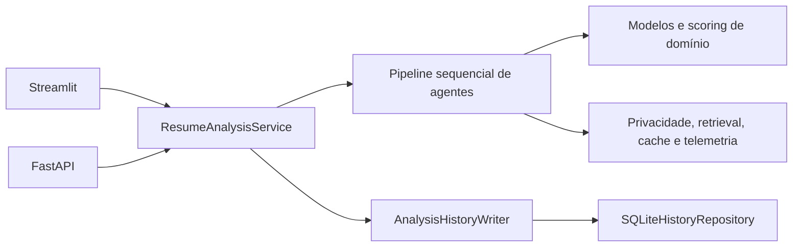
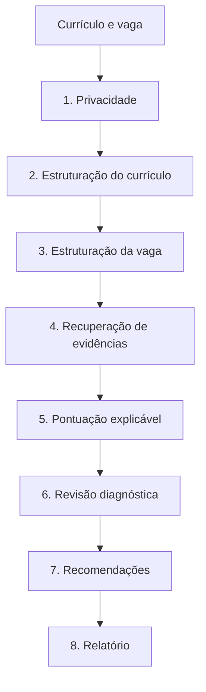

# Arquitetura da V6

## Visão geral

Resume Match AI é uma aplicação local organizada em camadas. Streamlit e FastAPI
adaptam entradas e saídas; ambos chamam o mesmo serviço de aplicação. A lógica de
matching fica em `resume_ai` e não depende dos frameworks de apresentação.

Não existe orquestração por LangGraph no código executado pela V6. O fluxo é uma
sequência explícita em `resume_ai/application/analyze_resume.py`; o agente revisor
produz diagnóstico e alertas, mas não dispara uma segunda passagem de recuperação.

## Camadas e dependências

- `resume_ai/domain`: modelos Pydantic e cálculo de score, sem dependência de UI.
- `resume_ai/application`: caso de uso `ResumeAnalysisService` e portas de
  persistência.
- `resume_ai/agents`: oito estágios pequenos, cada um retornando valor de domínio e
  `AgentResult`.
- `resume_ai/infrastructure`: documentos, uploads seguros, anonimização, embeddings,
  cache, SQLite, correlação, logs e métricas.
- `resume_ai/presentation`: componentes reutilizados pela interface Streamlit.
- `api`: adaptador HTTP FastAPI, autenticação por chave, limites e erros públicos.
- `app.py`: composição e apresentação Streamlit; não é uma segunda implementação do
  pipeline.
- `evaluation`: datasets sintéticos, métricas e runners de benchmark.

As árvores históricas `agents`, `services`, `resume_v4` e `utils` não fazem parte do
pacote distribuído nem da implementação canônica. O empacotamento inclui apenas
`api`, `evaluation` e `resume_ai`, além do módulo `app`.

## Pipeline multiagente real

1. O agente de privacidade anonimiza o currículo antes de qualquer embedding.
2. O agente de currículo extrai competências e trechos estruturados do texto
   anonimizado.
3. O agente de vaga identifica título, requisitos e prioridades.
4. O agente de evidências consulta os trechos em lote. TF-IDF, RapidFuzz e cobertura
   de conceitos sempre compõem o caminho lexical; embeddings e reranker são
   opcionais e têm fallback.
5. O agente de pontuação aplica limiares e pesos por prioridade.
6. O revisor marca lacunas obrigatórias e resultados próximos dos limiares para
   inspeção humana. Ele não altera o score nem reexecuta a recuperação.
7. Recomendações são derivadas apenas das evidências encontradas e das lacunas.
8. O relatório gera Markdown; JSON e CSV são serializados pelo serviço.

Todos os estágios usam o executor comum de `resume_ai/agents/base.py`. O
`AgentResult` registra `status`, `duration_ms`, `confidence`, `warnings`, referências
de evidência e metadados operacionais. Uma falha preserva a causa privada para
diagnóstico interno, mas produz um resultado seguro para logs e adaptadores.

## Matching e fallback

O currículo é dividido em trechos limitados. Para cada requisito, o motor calcula:

- similaridade TF-IDF;
- similaridade aproximada com RapidFuzz;
- cobertura de conceitos e aliases do catálogo local;
- similaridade semântica, quando o modelo de embedding carrega;
- score de CrossEncoder, quando o reranker está habilitado e carrega.

Os embeddings dos trechos são calculados em lote e reutilizados durante a vida da
instância. Se modelo, backend ou inferência falhar, a análise continua pelo caminho
lexical e registra o fallback no estado do motor e nos warnings do agente. O perfil
`demo` não significa “somente lexical”: por padrão ele tenta MiniLM com backend Torch.

## Estado, cache e persistência

Não há estado global de grafo. Cada chamada constrói um `AnalysisResult` tipado. O
cache de resultados usa um hash da versão, configurações e entradas; uma resposta
reutilizada recebe novo `analysis_id` e horário.

O cache padrão é em memória. Cache em disco só é aceito quando
`RESUME_STORE_ANONYMIZED_DOCUMENTS=true`, porque o resultado contém evidências
textuais anonimizadas.

A aplicação depende apenas da porta `AnalysisHistoryWriter`. A implementação padrão,
`SQLiteHistoryRepository`, salva ID, data, título inferido da vaga, perfil, score,
nível e um resumo JSON com score, estado do motor e tempos. Currículo, texto integral
da vaga e evidências não são persistidos no histórico. O histórico pode ser
desativado com `RESUME_HISTORY_ENABLED=false`.

## Fronteiras de confiança

- conteúdo enviado é não confiável até passar pela validação de upload e pelo parser;
- texto de currículo é sensível mesmo depois de anonimizado;
- logs aceitam somente eventos e campos enumerados pelo sanitizador;
- `X-Request-ID` recebido é normalizado antes de propagação;
- API key e segredos OIDC pertencem ao ambiente, nunca ao repositório;
- SQLite e caches locais pertencem ao operador da instalação;
- scores são apoio explicável, não decisão automatizada de contratação.

## Pontos de extensão

Novas interfaces devem depender de `ResumeAnalysisService`. Novos bancos devem
implementar as portas da camada de aplicação. Novos retrievers podem ser colocados
atrás do motor de embeddings sem alterar os agentes de score e relatório. Worker,
fila, PostgreSQL e frontend React são evoluções possíveis, mas não fazem parte da
V6.
